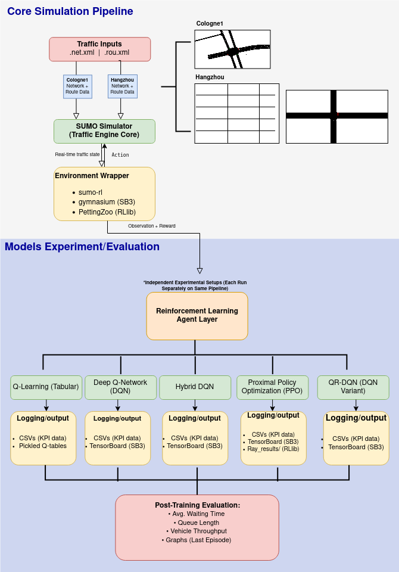

# 🚦 Adaptive Traffic Signal Control with Lightweight Reinforcement Learning

This project presents a comparative analysis of several lightweight reinforcement learning (RL) algorithms applied to adaptive traffic signal control. It evaluates the practicality of Q-Learning, DQN, QRDQN, and PPO models under real-world and synthetic traffic scenarios using the `sumo-rl` environment.

---




## 📦 Setup

```bash
pip install -r requirements.txt
````

### Required Software

* [SUMO](https://sumo.dlr.de/docs/Downloads.html) (Simulation of Urban Mobility)
* Python 3.8+
* PyTorch, Stable-Baselines3, Ray RLlib

---

## 🚀 How to Train Models

### Tabular Q-Learning

```bash
python experiments/ql_4x4grid_hangzhou.py
```

### PPO (Single-agent SB3)

```bash
python experiments/ppo_single_tls_cologne1.py

### PPO (Multi-agent RLlib)

```bash
python experiments/ppo_4x4grid_hangzhou.py-
```

### Fixed-Time Baseline

```bash
python experiments/fixed_single.py
```

---

## 📊 Results Summary

| Scenario | Best Model  | KPIs Optimized                    |
| -------- | ----------- | --------------------------------- |
| Cologne1 | PPO (SB3)   | ⏱️ Wait, 🚗 Arrivals, ✅ Stability |
| Hangzhou | PPO (RLlib) | ⏱️ Wait, ⚡ Fast Convergence       |

Visual results, metric tables, and training curves are in `/outputs/` and `/plots/`.

---

## 🧠 Implemented Algorithms

| Model                   | Framework            | Architecture   | Type               |
| ----------------------- | -------------------- | -------------- | ------------------ |
| Q-Learning              | Custom (Tabular)     | Per-TLS agent  | Tabular            |
| DQN                     | SB3 / Custom PyTorch | Single & Multi | Deep RL            |
| Hybrid DQN (Q-init)     | SB3 + Q-table bias   | Single         | Hybrid (Init Bias) |
| QRDQN                   | SB3-Contrib          | Single         | Dist. RL           |
| PPO                     | SB3 / Ray RLlib      | Single & Multi | Actor-Critic       |

---

## 📍 Traffic Scenarios

* **Cologne1**: Two-way real-world intersection from RESCO dataset
* **Hangzhou 4×4**: Synthetic, multi-intersection city-like grid

---

## 📁 Key Outputs

* `outputs/` → CSV logs with metrics per episode
* `plots/` → Combined graphs for comparison
* `iot_final_report.pdf` → Full academic writeup

---

## 🛠️ Acknowledgements

Developed as part of a Smart Systems & IoT course project (2025). Based on [sumo-rl](https://github.com/LucasAlegre/sumo-rl), with extensive customization for benchmark scenarios.

© 2025 Maryam Alshehyari, Bashayer Alsereidi, Naema Alkhzaimi

---

